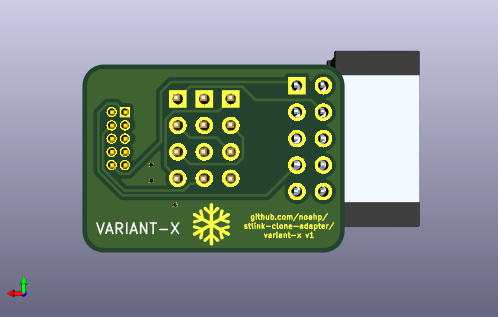

[](https://github.com/noahp/stlink-clone-adapter/actions)

# stlink-clone-adapter <!-- omit in toc -->

- [Variants](#variants)
  - [Variant 1](#variant-1)
  - [Variant 2](#variant-2)
  - [Variant X](#variant-x)
- [PCB Renders](#pcb-renders)
  - [Variant-1](#variant-1-1)
  - [Variant-2](#variant-2-1)
- [Part list](#part-list)
- [pyocd](#pyocd)

Adapter board for a 2x5 0.1" (2.54mm) header to arm cortex 10-pin connector.

This is useful when connecting ST-Link v2 clones to a standard ARM 2x5 1.27mm
pitch header.

## Variants

I know of 2 variants of the ST-Link v2 clones, with different pinouts on the 2x5 0.1"
(2.54mm) header. Different adapter boards provided for each variant.

One way to distinguish the variants; when unplugged, check for continuity on pins 3+4 or 5+6.

- pins 3+4 shorted, **variant-1**
- pins 5+6 shorted, **variant-2**

### Variant 1

Older model I bought in ~2016.

From the pin 1 marker on the header on the ST-Link, pinout is as follows:

|Funtion|Pin|Pin|Function|
|---|---|---|---|
|RST*|1|2|SWDIO|
|GND*|3|4|GND|
|SWIM|5|6|SWCLK|
|3.3V|7|8|3.3V|
|5.0V|9|10|5.0V|

**Note that the labeling is incorrect for some pins on the etching on the case /
on the silkscreen on the board. My device had the pinout for **Variant-2** on
the etching and just incorrect on the silkscreen markings 🤷.*

### Variant 2

Newer model I bought in 2020.

From the pin 1 marker on the header on the ST-Link, pinout is as follows:

|Funtion|Pin|Pin|Function|
|---|---|---|---|
|RST|1|2|SWCLK|
|SWIW|3|4|SWDIO|
|GND|5|6|GND|
|3.3V|7|8|3.3V|
|5.0V|9|10|5.0V|

Labeling appears to be correct on these devices.

### Variant X

*UNTESTED DESIGN*

Support both pinouts with a 3x4 0.1" header to select between them.

Alternative approaches:

- digital selection (mux the 4 connectors), controlled somehow by the signals.
  this has the defect of additional propogation losses through the mux, and
  complexity in the control circuit
- provide 2 2x5 0.1" headers on the board (would be a funky looking board!). the
  connectors are somewhat expensive at $0.80 @ qty 1 but makes for a simpler
  design
- provide a single 6-pin strip (3.3v, GND, RST, SWDIO, SWCLK, SWO) and use 0.1"
  jumper connectors to wire it to the probe (kinda janky connection vs. single
  connector though).




## PCB Renders

### Variant-1


### Variant-2


## Part list

- [2x5 header](http://www.digikey.com/product-search/en?keywords=SFH11-PBPC-D05-RA-BK)
- [arm 10 pin](http://www.digikey.com/product-detail/en/3220-10-0100-00/1175-1627-ND/3883661)
- [2x4 shunt/jumper](https://www.digikey.com/en/products/detail/amphenol-icc-fci/69145-208LF/1523748) [alternate](https://www.digikey.com/en/products/detail/samtec-inc/MNT-104-BK-G/6613574)

## pyocd

Quick note about using the stlink v2 clones with pyocd; I had the best luck
using the device after updating the firmware using the [official ST
updater](https://www.st.com/en/development-tools/stsw-link007.html):

```bash
❯ java -jar stsw-link007/AllPlatforms/STLinkUpgrade.jar -jtag_swim -force_prog
Firmware version detected: V2J29S7
................Upgrade is successful.
Version read: 2.37.7
```

After upating the version should report `V2J37S7` if you run the updater again.

There's a ton of information out there on the stlink devices themselves (I found
[this](https://hackaday.io/project/162597-st-link-clone-repurposing) helpful).

On ubuntu there's an available package
[stlink-tools](https://packages.ubuntu.com/search?keywords=stlink-tools)
([source](https://github.com/stlink-org/stlink)) which contains some utilities and udev rules for the st-link devices. I didn't end up using the tools themselves
but it could come in handy.
